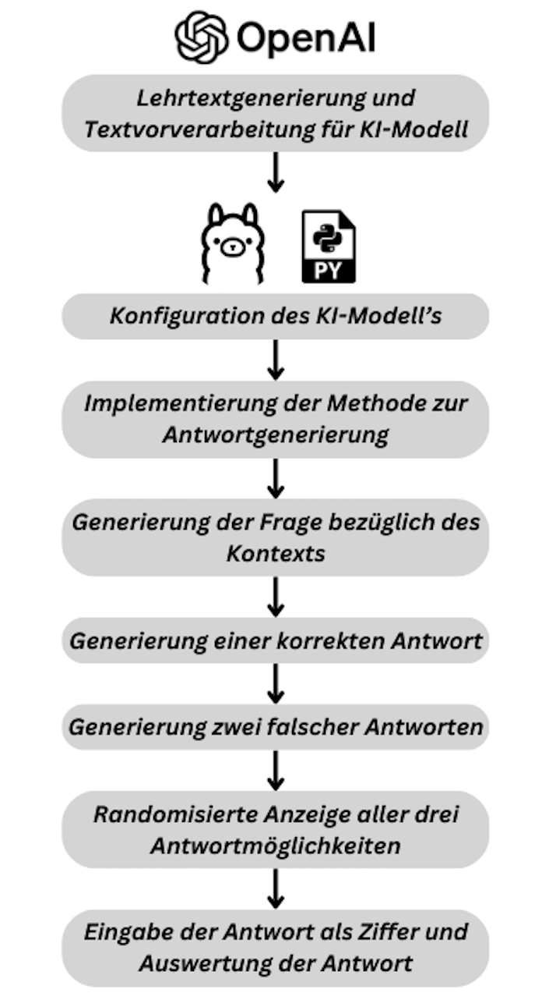

# Project Setup Guide

This guide will walk you through the steps needed to set up the project.

## Prerequisites

- Anaconda
- Ollama
- Visual Studio Code (VS Code)


## Steps

1. **Download the files:**
   Make sure to download the environment file as a .yaml and download context\_based\_questions.ipynb file.

2. **Install Anaconda:**
   Download and install Anaconda from [here](https://www.anaconda.com/download/success), search and run the "Anaconda Prompt (miniconda3)" console.

3. **Configure Conda to use conda-forge:**
   Run the following command in the Anaconda Prompt (miniconda3) console:
   ```sh
   conda config --add channels conda-forge
4. **Create Conda Environment:**
   
   Navigate to the right location  within the Anaconda Prompt, for example by
   running the following command if the .yaml is located at "Downloads":

   *Windows:*
   ```
   cd %USERPROFILE%\Downloads
   ```
   *Unix:*
   ```
   cd ~/Downloads
   ```
   
   Ensure the .yaml file is located at "Downloads" and run:
   ```sh
   conda env create -f conda_environment.yaml
   ```

5. **Install Ollama and Gemma:2b:**
   Follow the instructions provided by Ollama from [here]([https://www.python.org/downloads/](https://ollama.com)) to install it. Then, install the Gemma:2b package by running the following command in the normal Windows or Unix console:
   ```sh
   ollama run gemma:2b
   ```

6. **Start working:**
   You can close all the windows including the consoles, just make sure, that Ollama is running in the background.

7. **Run the Jupyter-Notebook-Project:**

    To run the Jupyter Notebook project, follow these steps:
    
    1. Open the Jupyter Notebook in VS Code and press "Select Kernel" in the upper right corner, then choose "master (Python 3.10.14)". (If you are using the environment for the first time, you may have to press Select Kernel - Select another Kernel...- Python Environments - master (Python 3.10.14))
    2. Go through each cell of the notebook and press the "Play" button (▶️) or use the keyboard shortcut "Shift + Enter" to execute the cell.
    3. When playing "#Cell 7", enter your answer as a digit in the input field and press "Enter".

    Make sure to execute each cell in sequence to ensure that all necessary variables and functions are correctly defined.




   
